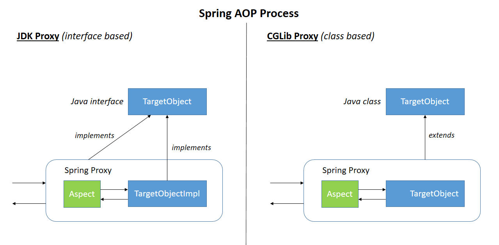

# AOP

AOP: Aspect Oriented Programming，面向切面编程。

## AOP Alliance

[AOP 联盟](https://aopalliance.sourceforge.net/)是 java对于AOP提供的一系列**标准接口**，顶层接口有： 

- Advice通知，及其继承接口MethodInterceptor方法拦截器； 
- JointPoint连接点，及其继承接口MethodInvocation。

```xml
<dependency>
 	<groupId>aopalliance</groupId>
 	<artifactId>aopalliance</artifactId>
    <version>1.0</version>
</dependency>
```

## Java 依赖注入标准（JSR-330）

JSR-330 (Dependency Injection for Java)  该规范主要是**面向依赖注入使用者**，而**对注入器实现、配置并未作详细要求**。

* **@Inject** - Identifies injectable constructors, methods, and fields
* **@Qualifier** - Identifies qualifier annotations
* **@Scope** - Identifies scope annotations
* **@Named** - String-based qualifier
* **@Singleton** - Identifies a type that the injector only instantiates once
* **Provider** - Provides instances of T. Typically implemented by an injector

目前 **Spring、Guice 已经开始兼容该规范**，JSR-299（Contexts and Dependency Injection for Java EE platform，参考实现 Weld）在依赖注入上也使用该规范。

## 开源AOP实现

### [Hutools AOP](https://doc.hutool.cn/pages/aop/)

> 动态代理，无法针对`new`出来的对象。
>
> [Demo代码](https://gitee.com/oscsc/web-tech/tree/master/aop)

AOP模块主要针对JDK中动态代理进行封装，抽象动态代理为切面类`Aspect`，通过`ProxyUtil`代理工具类将切面对象与被代理对象融合，产生一个代理对象，从而可以**针对每个方法执行前后做通用的功能**。

 提供 Aspect 接口，`before`、`after` 和 `afterException`接口，实现对类的方法进行拦截。

- 只能对单个类进行拦截；
- 对不同的方法的不同处理，需要自己写逻辑处理；

实现机制（按照优先级排序）

- 使用 **[Cglib](https://github.com/cglib/cglib)** 实现切面（**无需定义接口**即可对对象直接实现切面）
- 使用 [**Spring Cglib**](https://github.com/spring-projects/spring-framework/blob/main/spring-core/src/main/java/org/springframework/cglib/package-info.java)实现切面（因为 Cglib 不再维护）
- 使用 **JDK 的动态代理**实现切面（**代理对象必须实现接口**）
  - 通过 `Proxy.newProxyInstance` 创建的接口的子类


### Guice AOP

> 实现 AOP Alliance 的接口，支持 JSR-330 依赖注入标准。
>
> [Demo代码](https://gitee.com/oscsc/web-tech/tree/master/aop/guice/)

**轻量级IoC**（依赖注入框架）容器，类似Spring-AOP。Guice 通过**代码的形式来注入并管理依赖**。

- Guice：整个框架的门面
- Injector：一个依赖的管理上下文
- Binder：一个接口和实现的绑定
- Module：一组 Binder
- Provider：bean 的提供者
- Key：Binder 中对应一个 Provider
- Scope：Provider 的作用域

**依赖注入(bind)**

Guice官方推荐我们首选JSR-330标准的注解。

| *JSR-330* javax.inject | *Guice* com.google.inject |                                        |
| ---------------------- | ------------------------- | -------------------------------------- |
| @Inject                | @Inject                   | 在某些约束下可互换                     |
| @Named                 | @Named                    | 可互换                                 |
| @Qualifier             | @BindingAnnotation        |                                        |
| @Scope                 | @ScopeAnnotation          | 可互换                                 |
| @Singleton             | @Singleton                | 可互换                                 |
| Provider               | Provider                  | Guice的Provider继承了JSR-330的Provider |

**AOP(binder)**

通过对匹配的类/匹配的方法，执行切面函数

- 注意：**切面依赖仍然走切面**的话那么程序就陷入**死循环**

```java
private static class MainModule extends AbstractModule {
    @Override
    protected void configure() {
        // 默认不是单例模式，需要指定 in scope 或者在实现类上使用 @Singleton
        bind(Animal.class).to(Cat.class).in(Scopes.SINGLETON);
        // 绑定一个实例，永远是单例
        // bind(Animal.class).toInstance(new Cat());
        // 泛型绑定
        // bind(new TypeLiteral<List<Animal>>(){}).toInstance(Arrays.asList(new Dog(),new Cat()));

        // AOP, 对匹配的类/匹配的方法，执行切面函数
        binder().bindInterceptor(Matchers.subclassesOf(Animal.class), Matchers.any(), new AopFunc());
    }
}
```


### AspectJ AOP

> AspectJ 属于静态AOP框架，采用 ajc 编译器。

[AspectJ](http://www.eclipse.org/aspectj) 作为 Java 中流行的 **AOP（aspect-oriented programming）** 编程扩展框架，其内部使用的是 **[BCEL框架](https://github.com/apache/commons-bcel)** 来完成其功能。

- **在一些固定的切入点来进行操作**；
- **匹配规则采用了类似正则表达式的规则**；
- 对于运行中的java进行**无法在不重启的条件下执行新增MOCK**；
- MOCK功能代码嵌入到目标函数中，**无法对MOCK功能代码进行卸载**，可能带来稳定性风险。

AspectJ属于**编译时增强**，在运行前织入的，分为三类：

- **编译时织入**：如类 A 使用 AspectJ 添加了一个属性，类 B 引用了它，这个场景就需要编译期的时候就进行织入，否则没法编译类 B；
  - **java源码 + aspectJ特殊语法的‘配置’ 文件 + aspectJ特殊的编译器**
- **编译后织入**：生成了 .class 后需要增强处理；
  - 需要**特殊的编译器**
- **加载时织入**：在加载类的时候进行织入，使用**AspectJ agent**


### Spring AOP

> springaop的源码中包含（复制）了 AOP Alliance 的接口定义；
>
> spring aop 仅使用aspectJ 注解的一小部分（因此springboot aop starter 依赖 aspectjweaver）；
>
> - spring aop 的实现有 JDK 和 cglib 两种动态代理的实现（默认采用 cglib）；
> - spring aop 的 cglib 代理复制了 cglib 的实现，并定制，支持高版本的 JDK；

Spring AOP 基于**动态代理**来实现的，在容器启动时需要生成代理实例，在方法调用上也会增加栈的深度，使得 Spring AOP 的性能不如 AspectJ；

- **Spring AOP无法代理new出来的对象，只能代理被spring容器管理的对象**

